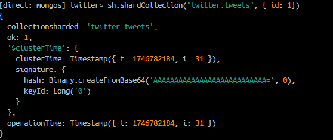

# mongodb-ola

## Setup

For the sharding environment we chose to set it up with docker, so it can run on a single machine simulating the sharding network. A docker-compose file was made to create a separate container for each of the 4 instances needed for the sharding environment - 1 config server, 2 shards and a mongos server to handle incoming traffic from clients.

```yml
version: "3.8"

services:
  configsvr:
    image: mongo:7.0
    command: --configsvr --replSet configReplSet --port 27018
    container_name: configsvr
    ports:
      - 27018:27018
    volumes:
      - configsvr:/data/db

  shard1:
    image: mongo:7.0
    command: --shardsvr --replSet shard1ReplSet --port 27019
    container_name: shard1
    ports:
      - 27019:27019
    volumes:
      - shard1:/data/db

  shard2:
    image: mongo:7.0
    command: --shardsvr --replSet shard2ReplSet --port 27020
    container_name: shard2
    ports:
      - 27020:27020
    volumes:
      - shard2:/data/db

  mongos:
    image: mongo:7.0
    container_name: mongos
    depends_on:
      - configsvr
      - shard1
      - shard2
    command: >
      mongos --configdb configReplSet/configsvr:27018 --bind_ip_all --port 27021
    ports:
      - 27021:27021

volumes:
  configsvr:
  shard1:
  shard2:
```

Keep in mind we chose to deviate from using the usual port 27017 to avoid conflicts with existing localhost mongoDB instances. 

After spinning up the containers, each node of the sharding environment has to be initiated. This is done by going into each container and readying the node for being a part of the sharding environemnt.

#### config server initiation (docker exec -it configsvr mongosh --port 27018):

```
rs.initiate({
_id: "configReplSet",
configsvr: true,
members: [{ _id: 0, host: "configsvr:27018" }]
})
```

#### shard1 initiation (docker exec -it shard1 mongosh --port 27019):
```
rs.initiate({
_id: "shard1ReplSet",
members: [{ _id: 0, host: "shard1:27019" }]
})
```

#### shard2 initiation (docker exec -it shard2 mongosh --port 27020):
```
rs.initiate({
_id: "shard2ReplSet",
members: [{ _id: 0, host: "shard2:27020" }]
})
```

#### mongos setup (docker exec -it mongos mongosh --port 27021)
```
sh.addShard("shard1ReplSet/shard1:27019")
sh.addShard("shard2ReplSet/shard2:27020")
```
In this step we are telling mongos (the node handling traffic to the shards) where to find the shards and add them to the cluster.

Verify that shards are setup correctly:
```
sh.status()
```


The last step is to enable sharding on a DB, and for good measure we are also defining an index and setting up the sharding system to use that index for splitting and chunking data. (In this case we will be using the id of the tweets that is to be imported later)

Keep in mind this is still operating in mongo shell inside the mongos container.

```
//twitter here being the name of the DB that is being created
sh.enableSharding("twitter")
//Creating index on the collection tweets, named id.
db.tweets.createIndex({ id: 1 })
//This step is where we tell the sharding environment to use the id of tweets collection inside the twitter DB for sharding (splitting and chunking data).
sh.shardCollection("twitter.tweets", { id: 1 })
```


#### Importing data

For importing data we connected to the database using MongoDB Compass (connected via mongodb://localhost:27021) and used the import feature. Although that required us to convert the tweets.bson file to json, as bson is incompatible with that feature. We used a small python script to achieve this: 

```python
from bson import decode_all
from bson.json_util import dumps

with open('./tweets.bson','rb') as f:
    data = decode_all(f.read())

with open("./tweets.json", "w") as outfile:
    outfile.write(dumps(data, indent=2))
```

After data import was done, we looked into how the data was being distributed in the shards: 

```
db.tweets.getShardDistribution()
```


All data is in 1 chunk in shard1, because mongos begins sharding data at 64mb as standard. 

